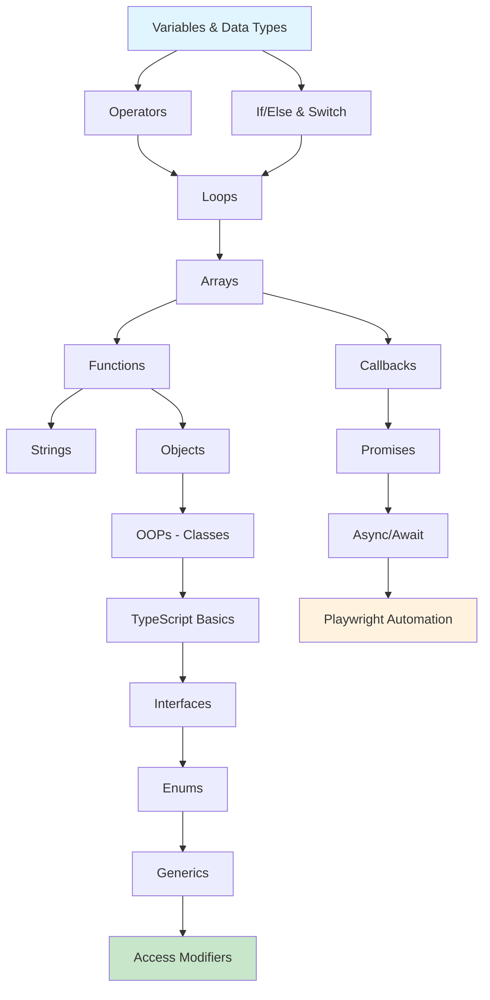

# LEARNPLAYWRITE2X

A structured JavaScript learning repository with hands-on examples, organized by chapters to build concepts from basics to advanced topics.

---

## Overview

This repository contains practical JavaScript code examples and exercises designed for learning core language concepts. Each chapter focuses on specific topics, making it easy to follow along and practice.

---

## Learning Path


---

## Topic Dependency Diagram



---

## Repository Structure

```
LEARNPLAYWRITE2X/
├── chapter_01_Basics/
│   ├── 01_Basics.js              # Variables, console.log, var/let/const
│   ├── 02_JS.js                  # JavaScript fundamentals
│   ├── 03_Verify_setup.js        # Environment verification
│   └── 04_Hotcode.js             # Quick code snippets
├── chapter_02_Javascript_Concept/
│   └── 05_JS_Basics.js           # JavaScript basics
├── chapter_03_Identifier_Literals/
│   ├── 06_Identifier_Rules.js    # Identifier rules reference
│   ├── 07_Identifier_Rules_Part2.js # Extended identifier examples
│   ├── 08_Comments.js            # Comments in JavaScript
│   ├── js_identifier_rule.js     # Identifier rule utilities
│   └── VS_keyboarrd_Short_window.md # Visual Studio Code Windows shortcuts reference
├── Chapter_04_Javascript_Concept/
│   ├── 09_var_let_const.js       # var vs let vs const comparison
│   ├── 10_functions.js           # Function declarations and usage
│   ├── 11_var_explained.js       # var keyword deep dive
│   ├── 12_let_explained.js       # let keyword deep dive
│   ├── 13_const_explained.js     # const keyword deep dive
│   ├── 14_var_functionscope.js   # var function scope behavior
│   ├── 15_let_functionscope.js   # let function scope behavior
│   ├── 16_Hoisting.js            # Variable hoisting with var
│   └── 17_hoisting_fn.js         # Function-scoped hoisting example
├── Chapter_20_OOPS/
│   └── 02_Class_object/
│       └── 177_static.js         # Static properties and class instances
```

---

## Chapters

### Chapter 1: Basics
Introduction to JavaScript fundamentals:
- Variables (`var`, `let`, `const`)
- Basic output with `console.log`
- Environment setup verification

### Chapter 2: JavaScript Concepts
Core language concepts:
- Identifier naming rules
- Valid vs invalid identifier names
- Naming conventions and case styles

### Chapter 3: Identifier Literals
Advanced identifier topics:
- camelCase, snake_case, PascalCase, SCREAMING_SNAKE_CASE
- Unicode characters in identifiers
- JavaScript comments
- VS Code keyboard shortcuts reference

### Chapter 4: JavaScript Concepts (Deep Dive)
Core language mechanics and behavior:
- `var`, `let`, `const` differences and redeclaration rules
- Function declarations and scope
- Variable hoisting behavior
- Function-scoped vs block-scoped variables

### Chapter 20: OOPS
Object-oriented programming concepts:
- Classes and objects
- Static properties and methods
- Instance creation and property access

---

## How to Run

1. **Clone the repository:**
   ```bash
   git clone https://github.com/vikrantchauhan1538-hub/LEARNPLAYWRITE2X.git
   cd LEARNPLAYWRITE2X
   ```

2. **Run a JavaScript file with Node.js:**
   ```bash
   node chapter_01_Basics/01_Basics.js
   ```

3. **Or run any specific file:**
   ```bash
   node Chapter_04_Javascript_Concept/16_Hoisting.js
   ```

---

## Prerequisites

- [Node.js](https://nodejs.org/) installed on your machine
- [Visual Studio Code](https://code.visualstudio.com/) (recommended) or any code editor
- Basic understanding of programming concepts (helpful but not required)

---

## Topics Covered

| Topic | File(s) |
|:---|:---|
| Variables & Data Types | `chapter_01_Basics/01_Basics.js` |
| Identifier Rules | `chapter_03_Identifier_Literals/06_Identifier_Rules.js` |
| Naming Conventions (camelCase, snake_case, PascalCase, etc.) | `chapter_03_Identifier_Literals/07_Identifier_Rules_Part2.js` |
| Comments | `chapter_03_Identifier_Literals/08_Comments.js` |
| VS Code Shortcuts | `chapter_03_Identifier_Literals/VS_keyboarrd_Short_window.md` |
| var vs let vs const | `Chapter_04_Javascript_Concept/09_var_let_const.js` |
| Functions | `Chapter_04_Javascript_Concept/10_functions.js` |
| var Explained | `Chapter_04_Javascript_Concept/11_var_explained.js` |
| let Explained | `Chapter_04_Javascript_Concept/12_let_explained.js` |
| const Explained | `Chapter_04_Javascript_Concept/13_const_explained.js` |
| var Function Scope | `Chapter_04_Javascript_Concept/14_var_functionscope.js` |
| let Function Scope | `Chapter_04_Javascript_Concept/15_let_functionscope.js` |
| Hoisting | `Chapter_04_Javascript_Concept/16_Hoisting.js` |
| Function Hoisting | `Chapter_04_Javascript_Concept/17_hoisting_fn.js` |
| Static Properties & Class Instances | `Chapter_20_OOPS/02_Class_object/177_static.js` |

---

## Naming Conventions Reference

| Case Style | Example | Valid in JS? | Typical Use |
|:---|:---|:---|:---|
| camelCase | `myVariableName` | Yes | Variables, functions |
| snake_case | `my_variable_name` | Yes | Object keys, APIs |
| PascalCase | `MyVariableName` | Yes | Classes, components |
| SCREAMING_SNAKE_CASE | `MY_VARIABLE_NAME` | Yes | Constants |
| kebab-case | `my-variable-name` | No | CSS classes, file names |

---

## Contributing

Feel free to add more examples, fix issues, or improve documentation. This is a personal learning repository, so contributions are welcome!

---

## Author

- **Vikrant Chauhan**

---

## License

This project is for educational purposes.
